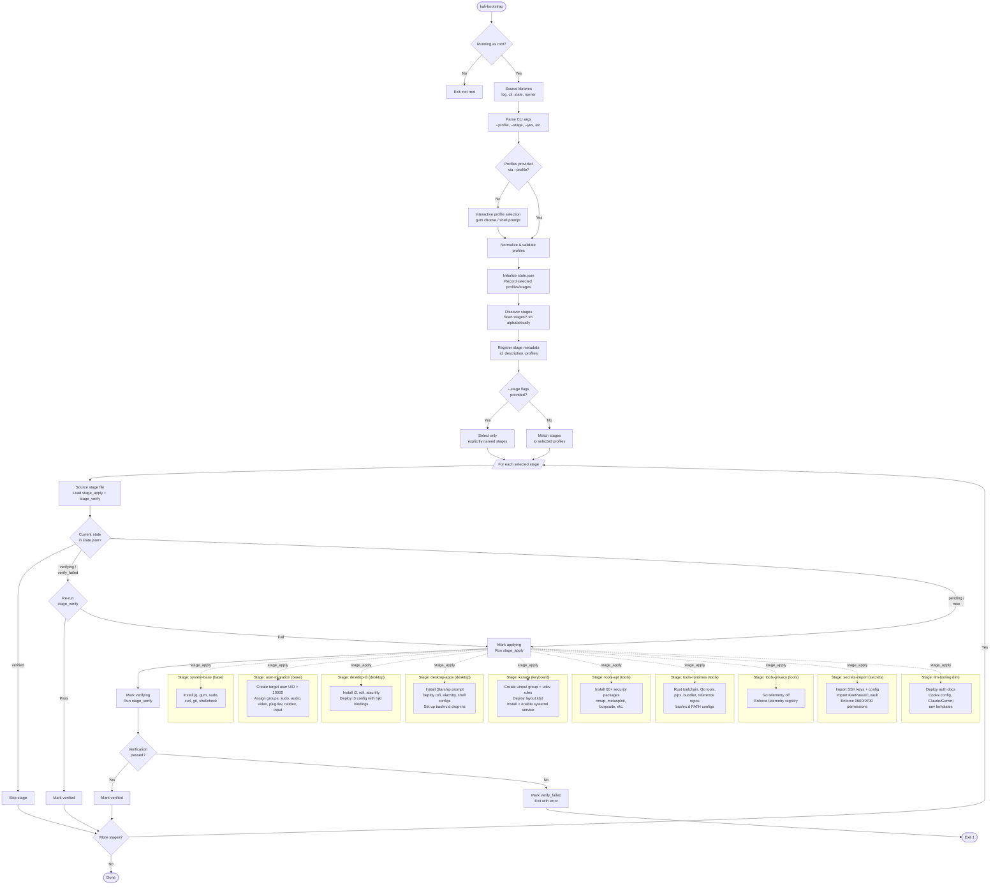

# kalidots

A modular, resumable bootstrap system for Kali Linux workstations. Installs packages, configures a desktop environment, deploys dotfiles, imports secrets, and sets up LLM tooling — all driven by a profile-based stage runner with built-in state tracking and verification.

## Quick Start

```bash
# Interactive — prompts for profiles, username, passwords, etc.
sudo ./bootstrap/bin/kali-bootstrap

# Non-interactive — base + desktop for user "hacker"
sudo TARGET_USER=hacker ./bootstrap/bin/kali-bootstrap \
  --profile base --profile desktop --yes

# Resume after failure — skips already-verified stages
sudo ./bootstrap/bin/kali-bootstrap --profile base --profile tools
```

## Profiles

Profiles group stages by purpose. Select one or more at runtime.

| Profile | What it does |
|---------|-------------|
| **base** | Bootstrap prerequisites (jq, gum, git, etc.) and target user creation |
| **desktop** | i3 window manager, Rofi, Alacritty, Starship prompt |
| **keyboard** | Kanata keyboard remapper with systemd service, udev rules, optional enthium layout |
| **tools** | 60+ security packages (nmap, metasploit, burpsuite, etc.), language runtimes, telemetry opt-outs |
| **secrets** | SSH directory and KeePassXC database import with permission enforcement |
| **llm** | LLM auth documentation and config templates (Codex, Claude, Gemini) |
| **theme** | Color scheme overlays for desktop apps (requires desktop profile first) |

## Stages

Each stage declares which profiles it belongs to, an `stage_apply` function, and a `stage_verify` function. The runner discovers stages from `bootstrap/stages/*.sh` in alphabetical order.

| Stage | Profile | Description |
|-------|---------|-------------|
| `system-base` | base | Install jq, gum, sudo, curl, git, shellcheck |
| `user-migration` | base | Create target user (UID > 10000), assign groups |
| `bootstrap-user-cleanup` | *(explicit only)* | Remove the bootstrap user — requires `--stage` flag |
| `desktop-i3` | desktop | Deploy i3 config with hjkl keybindings, install rofi + alacritty |
| `desktop-apps` | desktop | Starship prompt, shell configs, bashrc.d drop-ins |
| `desktop-neovim` | desktop | Neovim + LazyVim starter + pixel.nvim colorscheme |
| `kanata` | keyboard | Kanata keyboard remapper with systemd service + udev rules |
| `tools-apt` | tools | 60+ security tool packages from apt |
| `tools-runtimes` | tools | Rust toolchain, Go tools, pipx, bundler, reference repos |
| `tools-privacy` | tools | Telemetry opt-outs (Go telemetry, registry enforcement) |
| `secrets-import` | secrets | SSH keys + KeePassXC vault import with strict permissions |
| `llm-tooling` | llm | Deploy auth docs and config templates for LLM tools |
| `theme-pink-rot` | theme | Pink-rot color theme for alacritty, i3, rofi, i3status-rs, dunst, btop, starship, GTK |

## CLI Reference

```
sudo ./bootstrap/bin/kali-bootstrap [OPTIONS]

Options:
  --profile PROFILE       Profile to activate (repeatable: base, desktop, keyboard, tools, llm, secrets, theme)
  --stage STAGE_ID        Run specific stage(s) by ID, overrides profile matching (repeatable)
  --state-file PATH       Custom state file path (default: .bootstrap/state.json)
  --yes                   Skip confirmation prompts
  --bootstrap-user USER   User running the installer
  --target-user USER      Target primary user to create/configure
```

### Environment Variables

| Variable | Purpose |
|----------|---------|
| `TARGET_USER` | Target primary user (prompted if unset) |
| `BOOTSTRAP_USER` | User running installer |
| `ASSUME_YES` | Skip confirmations (`true`/`false`) |
| `STATE_FILE` | State JSON path |
| `SSH_IMPORT_SOURCE` | SSH directory to import |
| `KEEPASSXC_DB_SOURCE` | KeePassXC vault path |
| `KEEPASSXC_KEYFILE_SOURCE` | KeePassXC keyfile path |
| `KANATA_LAYOUT_FILE` | Custom Kanata layout file |

## Architecture

### State & Resumability

Every stage run is tracked in `.bootstrap/state.json`. Each stage transitions through:

```
pending → applying → verifying → verified
                         ↓
                   verify_failed
```

On re-run, verified stages are skipped. Failed stages re-check verification before re-applying. This makes the entire bootstrap resumable and idempotent.

### Package Policy

Each profile has a policy file (`bootstrap/files/packages/*-policy.env`) controlling:

- **Platform**: Must be `kali`
- **Allow external**: Whether non-apt sources are permitted
- **External exceptions**: Specific tools allowed from external sources (e.g., Starship, Kanata, rustup)

### Desktop Environment

- **Window manager**: i3 with Omarchy-style hjkl keybindings
- **Terminal**: Alacritty
- **Launcher**: Rofi (drun mode)
- **Shell**: Vi-mode readline, Starship prompt, bashrc.d drop-in system
- **Keyboard** *(separate `keyboard` profile)*: Kanata remapper via systemd + udev (uinput group), optional enthium layout

## Repository Structure

```
bootstrap/
├── bin/kali-bootstrap          # Entry point
├── lib/                        # Shared libraries
│   ├── cli.sh                  #   CLI parsing, profile selection
│   ├── log.sh                  #   Logging utilities
│   ├── state.sh                #   JSON state management (jq)
│   ├── runner.sh               #   Stage discovery and execution
│   ├── packages.sh             #   Apt install + policy enforcement
│   ├── users.sh                #   User creation and group management
│   ├── desktop.sh              #   Config file deployment
│   ├── secrets.sh              #   SSH/KeePassXC import handlers
│   └── llm.sh                  #   LLM tool manifest loading
├── stages/                     # Stage scripts (auto-discovered)
│   ├── 10-system-base.sh
│   ├── 20-user-migration.sh
│   ├── 21-bootstrap-user-cleanup.sh
│   ├── 30-desktop-i3.sh
│   ├── 31-desktop-apps.sh
│   ├── 35-keyboard-kanata.sh
│   ├── 40-tools-apt.sh
│   ├── 41-tools-runtimes.sh
│   ├── 42-tools-privacy.sh
│   ├── 50-secrets-import.sh
│   └── 60-llm-tooling.sh
├── files/                      # Config files and manifests
│   ├── packages/               #   Apt lists + policy files per profile
│   ├── user/                   #   Required groups, migration checklist
│   ├── desktop/                #   i3, rofi, alacritty, kanata, shell configs
│   ├── systemd/                #   Kanata service + udev rules
│   ├── tools/                  #   Reference repo list
│   ├── secrets/                #   Import policy
│   ├── privacy/                #   Telemetry registry
│   └── llm/                    #   Tool manifest, auth docs, config templates
└── tests/                      # Unit tests for library functions
```

## Control Flow


